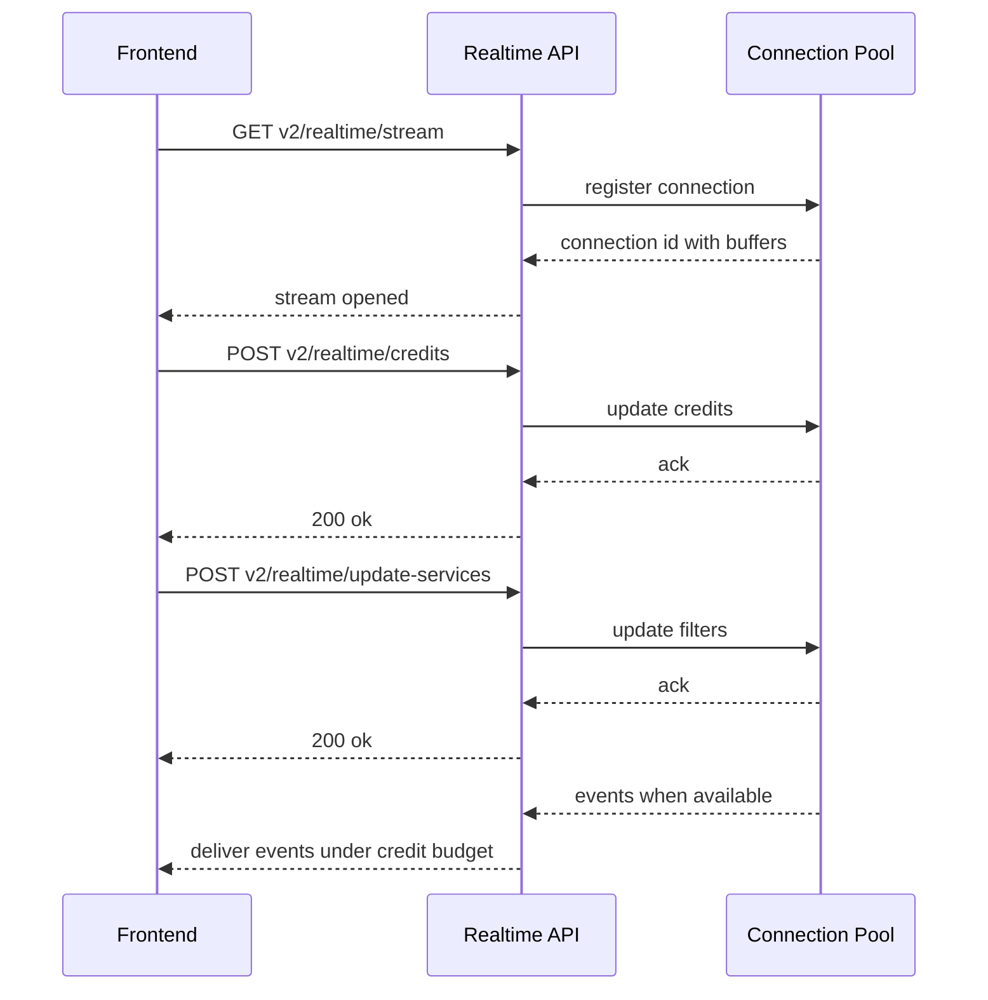
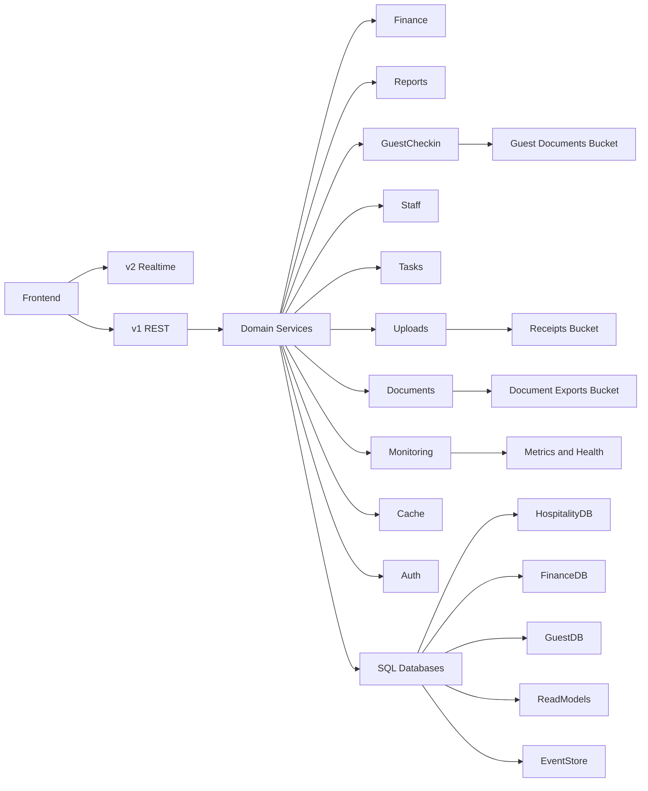

# Complex Feature Documentation — Hospitality Management Platform

Last updated: 2025-12-09
Source of truth: encore-mcp live metadata and the codebase. MCP config: [.kilicode/mcp.json](.kilocode/mcp.json)

Scope
- Explains the platform's most complex features, their architecture, data flows, API endpoints, and operational runbooks
- Links to code anchors and live endpoints discoverable via encore-mcp

Inventory snapshot
- Services: 29
- Endpoints: 608
- Databases: 7
- Storage buckets: 5
- Realtime: v2 unified streaming; v1 long-poll compatibility

Feature A — Unified Realtime v2 streaming
- Purpose: Consolidated event delivery with credit based flow control and dynamic subscription updates
- Key endpoints
  - GET v2/realtime/stream
  - GET v2/realtime/metrics
  - POST v2/realtime/credits
  - POST v2/realtime/update-services
- Code anchors
  - Server core: [backend/realtime/connection_pool.ts](backend/realtime/connection_pool.ts)
  - Frontend provider example: [frontend/providers/RealtimeProviderV2_Fixed.tsx](frontend/providers/RealtimeProviderV2_Fixed.tsx)
  - Guides: [README_STREAMING_API.md](README_STREAMING_API.md), [docs/REALTIME_PROVIDER_FINANCE.md](docs/REALTIME_PROVIDER_FINANCE.md)
- Flow summary
  - Client opens stream and sends initial service filters and property scope
  - Server registers connection and starts buffered delivery
  - Client periodically POSTs credits to control pacing and avoid overload
  - Subscriptions can be updated live via update services
  - Metrics are exposed for observability and capacity planning
- Sequence diagram

- Operational notes
  - If clients fall behind, reduce credits and enable conflation on non critical streams
  - Use v2/realtime/metrics for buffer depth, delivery latency, and connection counts

Feature B — Finance partitioned data model
- Purpose: Keep p95 low on time series data and enable audit friendly storage
- Physical layout
  - Partition parents and quarterly children tables for revenues and expenses
  - Verified databases include expenses_2024_q4, expenses_2025_q1..q4, revenues_2024_q4, revenues_2025_q1..q4, plus default and partitioned parents
- Lifecycle
  - Cron creates next month partitions and optionally cleans old ones
  - Monitoring verifies partition presence and health
- Key endpoints and jobs
  - Create partitions monthly: POST v1/system/cron/partitions/create-next-month
  - Cleanup partitions mid month optional: POST v1/system/cron/partitions/cleanup
  - Verify partitions: GET v1/system/monitoring/partitions/verify
- Code and docs
  - Monitoring utility: [backend/monitoring/verify_partitions.ts](backend/monitoring/verify_partitions.ts)
  - Implementation guides: [database-partitioning-implementation-guide.md](database-partitioning-implementation-guide.md), [PARTITION_IMPLEMENTATION_SUMMARY.md](PARTITION_IMPLEMENTATION_SUMMARY.md)

Feature C — Reports and reconciliation engine
- Purpose: Daily and monthly financial consistency with exports to Excel and PDF
- Capabilities
  - Daily cash balances with smart opening balance calculation and chain validation
  - Monthly and yearly summaries with category breakdowns
  - High volume exports and reconciliation workflows
- Key endpoints
  - Reports retrieval: GET v1/reports/daily-report, GET v1/reports/monthly-report, GET v1/reports/monthly-summary
  - Reconciliation: POST v1/reports/reconcile-daily-cash-balance, POST v1/reports/validate-balance-chain
  - Exports: POST v1/reports/export/daily-excel, POST v1/reports/export/daily-pdf, POST v1/reports/export/monthly-excel, POST v1/reports/export/monthly-pdf
- Code and docs
  - Reports domain: [backend/reports](backend/reports)
  - Daily report core: [backend/reports/daily_reports.ts](backend/reports/daily_reports.ts)
  - Exports implementation: [DOCUMENT_EXPORT_IMPLEMENTATION.md](DOCUMENT_EXPORT_IMPLEMENTATION.md)

Feature D — Guest identity capture and verification
- Purpose: Secure document intake with extraction only flows and audit signals
- Storage and privacy
  - Bucket guest-documents with private signed URLs
  - Extraction only pattern to minimize server side storage
- Key endpoints
  - Upload: POST v1/guest-checkin/documents/upload
  - Extraction only: POST v1/guest-checkin/documents/extract-only
  - Verification: POST v1/guest-checkin/documents/documentId/verify
  - Thumbnails and secure view: GET v1/guest-checkin/documents/documentId/thumbnail, GET v1/guest-checkin/documents/documentId/view
- Code and docs
  - Service: [backend/guest-checkin](backend/guest-checkin)
  - Summary: [GUEST_CHECKIN_SUMMARY.md](GUEST_CHECKIN_SUMMARY.md)
  - Client side storage guidance: [CLIENT_SIDE_STORAGE_IMPLEMENTATION.md](CLIENT_SIDE_STORAGE_IMPLEMENTATION.md)
  - Size limits: [FILE_UPLOAD_SIZE_LIMITS.md](FILE_UPLOAD_SIZE_LIMITS.md)

Feature E — Long poll compatibility for v1
- Purpose: Transitional path for domains not yet on v2 streaming
- Patterns
  - 25s long poll windows with immediate return on available events
  - Audit events and checkin updates delivered via domain specific endpoints
- Example endpoints
  - GET v1/guest-checkin/audit-events/subscribe
  - GET v1/guest-checkin/realtime/subscribe
  - GET v1/finance/events/subscribe
- Notes
  - Keep long poll traffic scoped per org and property to control load
  - Prefer migrating hot paths to v2 streaming when feasible

Feature F — Auth sessions and refresh rotation
- Purpose: Central JWT auth at the gateway with robust session security and indexing
- Key endpoints
  - POST v1/auth/login, POST v1/auth/refresh, POST v1/auth/logout, GET v1/auth/me
- Code anchors
  - Token flow and rotation: [backend/auth/refresh.ts](backend/auth/refresh.ts)
  - Session index migrations: [backend/auth/migrations/15_add_sessions_composite_index.up.sql](backend/auth/migrations/15_add_sessions_composite_index.up.sql), [backend/auth/migrations/15_add_sessions_composite_index.down.sql](backend/auth/migrations/15_add_sessions_composite_index.down.sql)
- Notes
  - Session tables use composite indexes for fast lookups and invalidation
  - Debug endpoints exist under v1/auth/debug to assist troubleshooting

Feature G — Document exports lifecycle
- Purpose: Robust export pipeline with short lived signed URLs and automated cleanup
- Process
  - Export jobs queued and processed internally
  - Result artifacts stored in document-exports bucket with 1 hour signed URLs
  - Daily cron cleans up expired artifacts
- Key endpoints
  - Create export: POST v1/documents/exports/create
  - Download export: GET v1/documents/exports/exportId/download
  - Cleanup: POST documents/cleanup and nightly cron at 2 AM
- Docs
  - Export design: [DOCUMENT_EXPORT_IMPLEMENTATION.md](DOCUMENT_EXPORT_IMPLEMENTATION.md)

Feature H — Networking, caching and baseline metrics
- Purpose: Consistent p95 for GET endpoints with cache aware patterns and clear metrics
- Cache lifecycle
  - L1 in process caching with explicit invalidation and stats collection
  - Cron jobs for cache warming every 5 minutes and stats hourly
- Metrics
  - Baseline metrics endpoints to observe TTFB and payloads by family
- Anchors
  - Design notes: [docs/NETWORKING_AND_REALTIME_IMPROVEMENTS.md](docs/NETWORKING_AND_REALTIME_IMPROVEMENTS.md)
  - Cache endpoints live under system cache namespace
  - Example monitoring endpoints under v1/system/monitoring

Feature I — Monitoring and partition verification
- Purpose: Operability and SLO adherence via unified health and deep checks
- Highlights
  - Health, readiness, liveness under v1/system paths
  - Aggregated metrics and alert history endpoints
  - Partition verification for finance and time series tables
- Anchors
  - Verification utility: [backend/monitoring/verify_partitions.ts](backend/monitoring/verify_partitions.ts)
  - MCP diagnosis: [ENCORE_MCP_SERVER_DIAGNOSIS.md](ENCORE_MCP_SERVER_DIAGNOSIS.md)

Feature J — API versioning and migration window
- Strategy
  - Standardize new REST under v1 with legacy routes mapped during migration
  - Isolate transport concerns by putting realtime under v2
- References
  - App config and service definitions: [backend/encore.app](backend/encore.app)
  - Complete catalog: [docs/API_COMPLETE_REFERENCE.md](docs/API_COMPLETE_REFERENCE.md)

Integration map at a glance

Operational runbooks per feature
- Realtime v2
  - Inspect metrics: GET v2/realtime/metrics
  - Throttle delivery: POST v2/realtime/credits with reduced credits on hot orgs
  - Update scopes: POST v2/realtime/update-services
- Partitions
  - Create next month: POST v1/system/cron/partitions/create-next-month
  - Verify presence: GET v1/system/monitoring/partitions/verify
  - Optional cleanup: POST v1/system/cron/partitions/cleanup
- Reports and exports
  - Generate daily: POST v1/reports/export/daily-excel or daily-pdf
  - Download: GET v1/documents/exports/exportId/download
  - Clean expired: confirm 2 AM cleanup cron runs
- Guest documents
  - Intake: POST v1/guest-checkin/documents/upload
  - Extract only: POST v1/guest-checkin/documents/extract-only
  - Verify: POST v1/guest-checkin/documents/documentId/verify

Testing and troubleshooting with encore-mcp
- Inventory services and endpoints: get_services
- Verify databases and tables: get_databases include_tables true
- Inspect storage buckets and usage: get_storage_buckets
- Check auth handler and gateways: get_auth_handlers
- Check cron schedules: get_cronjobs
- Examine middleware inventory: get_middleware
- Use these to validate the documentation against the live app before releases

Validation checklist
- Realtime v2 endpoints reachable and metrics sane at peak
- Partition children exist for current and next periods
- Reports generate within SLO and exports expire per policy
- Guest document flows honor extraction only guidance and signed URL rules
- Health and metrics endpoints green and surfacing correct data

Key references
- Realtime core: [backend/realtime/connection_pool.ts](backend/realtime/connection_pool.ts)
- Realtime guides: [README_STREAMING_API.md](README_STREAMING_API.md), [docs/REALTIME_PROVIDER_FINANCE.md](docs/REALTIME_PROVIDER_FINANCE.md)
- Partition verification: [backend/monitoring/verify_partitions.ts](backend/monitoring/verify_partitions.ts)
- Partition guides: [database-partitioning-implementation-guide.md](database-partitioning-implementation-guide.md), [PARTITION_IMPLEMENTATION_SUMMARY.md](PARTITION_IMPLEMENTATION_SUMMARY.md)
- Exports: [DOCUMENT_EXPORT_IMPLEMENTATION.md](DOCUMENT_EXPORT_IMPLEMENTATION.md)
- Networking and caching: [docs/NETWORKING_AND_REALTIME_IMPROVEMENTS.md](docs/NETWORKING_AND_REALTIME_IMPROVEMENTS.md)
- Auth flow: [backend/auth/refresh.ts](backend/auth/refresh.ts)
- App config: [backend/encore.app](backend/encore.app)
- MCP diagnosis: [ENCORE_MCP_SERVER_DIAGNOSIS.md](ENCORE_MCP_SERVER_DIAGNOSIS.md)

Change management
- Regenerate counts via encore-mcp before publishing
- Keep this document synchronized with code anchors and [docs/API_COMPLETE_REFERENCE.md](docs/API_COMPLETE_REFERENCE.md)