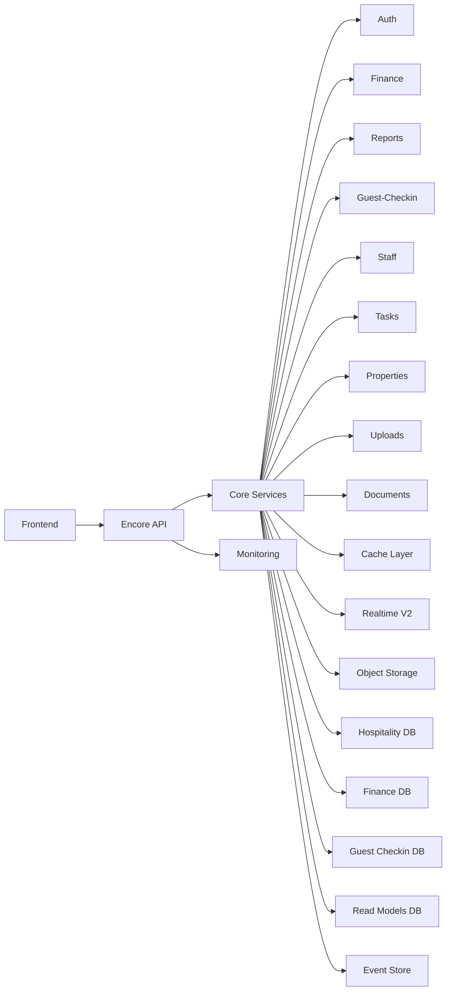

# Architecture Overview — Hospitality Management Platform (Concise)

Last updated: 2025-12-09
Source-of-truth: encore-mcp live metadata. Configuration: [.kilocode/mcp.json](.kilocode/mcp.json)

## Scope
- 800–1200 words
- Includes services, data stores, realtime, caching, auth, monitoring
- One diagram and links to key files

## System Topology
The platform is a modular, service-oriented Encore application. 29 services expose 600+ endpoints across business domains (auth, finance, reports, guest-checkin, staff, properties, tasks, users, uploads, documents) and ops domains (monitoring, realtime, database, cache, cron, config, validation, telemetry). Encore provides service discovery, typed endpoints, and managed infrastructure for databases, queues and storage.

## Diagram

## Services
- Business: auth, finance, reports, guest-checkin, staff, properties, tasks, users, uploads, documents
- Infrastructure: monitoring, realtime, database, cache, communication, config, cron, orgs, validation, telemetry
- Internal helpers: reports-service, events-service, finance-service, dashboard, middleware, seed
The list above is verified from encore-mcp and may evolve; use the MCP tool to enumerate services at any time. Live file entry points include [backend/finance](backend/finance), [backend/reports](backend/reports), [backend/guest-checkin](backend/guest-checkin), [backend/realtime/connection_pool.ts](backend/realtime/connection_pool.ts), [backend/monitoring/verify_partitions.ts](backend/monitoring/verify_partitions.ts).

## API and Versioning
- Standardized on /v1 endpoints across services while preserving legacy routes during migration windows.
- Streaming is delivered via a consolidated v2 realtime service that multiplexes domain events with flow control.
- The complete route inventory is mirrored in [docs/API_COMPLETE_REFERENCE.md](docs/API_COMPLETE_REFERENCE.md) and summarized in [docs/API_CONCISE_REFERENCE.md](docs/API_CONCISE_REFERENCE.md).

## Data Stores
- Hospitality: primary multi-tenant application database for auth, orgs, properties, staff, tasks, users, and shared metadata.
- Finance: ledger-grade store for revenues, expenses, approvals and reconciliations.
- Guest Checkin DB: guest lifecycle data, document verification state and audit trails.
- Read Models: pre-aggregated projections for reporting and dashboards.
- Event Store: append-only domain events supporting auditing and reconstruction.
- Health Check DB: infra health and readiness probes.
Databases are provisioned and wired via Encore. Partition readiness and replica health are verified through [backend/monitoring/verify_partitions.ts](backend/monitoring/verify_partitions.ts) and related dashboard endpoints.

## Realtime
The platform offers two complementary mechanisms:
- Long-poll subscriptions (v1) for services that prefer request-response semantics.
- Multiplexed streaming (v2) for consolidated event delivery with dynamic subscriptions, credit based flow control, and conflation. Core implementation anchor: [backend/realtime/connection_pool.ts](backend/realtime/connection_pool.ts) with architecture notes in [README_STREAMING_API.md](README_STREAMING_API.md) and finance client specifics in [docs/REALTIME_PROVIDER_FINANCE.md](docs/REALTIME_PROVIDER_FINANCE.md).

## Caching
A tiered cache design reduces load and latency, with explicit invalidation and metrics:
- L1 in-process memory for low-latency reads (see [backend/cache/cache_factory.ts](backend/cache/cache_factory.ts)).
- Optional external tiers can be added as needed; cache keys follow domain-specific namespaces to keep eviction targeted.
- Invalidation is exposed via ops endpoints so monitoring can confirm freshness and hit rates. Cache status surfaces to the UI through small health cards.

## Authentication and Authorization
- JWT-based authentication via a central auth handler; tokens are refreshed via endpoints like [backend/auth/refresh.ts](backend/auth/refresh.ts).
- Role based authorization enforced consistently across services at the API boundary, with property scope for multi tenancy.
- Sensitive operations are protected with additional validation and business rule checks to provide defense in depth.

## Monitoring and Observability
- Health and readiness endpoints across all services consolidated under monitoring.
- Metrics cover HTTP health, cache hit rates, database partitions, replica lag, and stream flow. See [backend/monitoring/MONITORING_ENDPOINTS_REFERENCE.md](backend/monitoring/MONITORING_ENDPOINTS_REFERENCE.md) and implementation utilities like [backend/monitoring/verify_partitions.ts](backend/monitoring/verify_partitions.ts).
- Operational dashboards and alerting baselines are described in [backend/monitoring/MONITORING_DASHBOARDS.md](backend/monitoring/MONITORING_DASHBOARDS.md).

## Reporting and Exports
- Reports service produces daily, monthly and P&L documents with reconciliation workflows. Core implementation and exports referenced in [backend/reports/daily_reports.ts](backend/reports/daily_reports.ts) and [DOCUMENT_EXPORT_IMPLEMENTATION.md](DOCUMENT_EXPORT_IMPLEMENTATION.md).
- Document and export storage leverages Encore object storage, with client side storage patterns available for special flows. See [CLIENT_SIDE_STORAGE_IMPLEMENTATION.md](CLIENT_SIDE_STORAGE_IMPLEMENTATION.md) and [FILE_UPLOAD_SIZE_LIMITS.md](FILE_UPLOAD_SIZE_LIMITS.md).

## Data Integrity and Auditability
- Immutable event trails support exact reconstruction of business state and audit review.
- Guest document verification and changes are logged with full provenance; see summaries in [GUEST_CHECKIN_SUMMARY.md](GUEST_CHECKIN_SUMMARY.md).
- Finance operations enforce idempotency, explicit approval steps, and daily close rules to prevent drift. Reference endpoints in [backend/finance](backend/finance).

## Performance and Scale
- Partitioned tables and replica strategies are employed for large time series datasets to keep p95 latencies low; see [database-partitioning-implementation-guide.md](database-partitioning-implementation-guide.md) and [PARTITION_IMPLEMENTATION_SUMMARY.md](PARTITION_IMPLEMENTATION_SUMMARY.md).
- Target SLAs: health >99.9 percent, standard GET p95 < 500ms, stream delivery p95 < 1s under nominal load. Compression, conflation and batching are used in streaming and export paths.
- Cache-aware APIs and read model projections minimize hot-path load, while monitoring continuously validates headroom.

## Versioning and Backward Compatibility
- New endpoints standardized under /v1 with shared handler patterns.
- Legacy routes remain temporarily mapped to give clients time to migrate cleanly.
- Streaming operates under a dedicated v2 service to isolate transport concerns from REST versioning.
- The API catalog is maintained in-source and can be regenerated from encore-mcp at any time.

## Security and Privacy
- Transport over HTTPS, bearer tokens for long-poll and streaming, and strict origin controls on the frontend.
- PII minimization and retention controls for documents. Client side extraction-only flows are documented to avoid cloud pollution; see [SOLUTION_SUMMARY.md](SOLUTION_SUMMARY.md).
- Robust permission checks for download and export actions, with audit logging to ensure non repudiation.

## How to Navigate the Codebase
- Backend domains: [backend/auth](backend/auth), [backend/finance](backend/finance), [backend/reports](backend/reports), [backend/guest-checkin](backend/guest-checkin), [backend/uploads](backend/uploads), [backend/documents](backend/documents).
- Realtime: [backend/realtime/connection_pool.ts](backend/realtime/connection_pool.ts)
- Monitoring: [backend/monitoring/verify_partitions.ts](backend/monitoring/verify_partitions.ts)
- Config: [backend/encore.app](backend/encore.app)
- Product and API docs: [docs/PRODUCT_CONCISE_DOCUMENTATION.md](docs/PRODUCT_CONCISE_DOCUMENTATION.md), [docs/API_COMPLETE_REFERENCE.md](docs/API_COMPLETE_REFERENCE.md)

## Using encore-mcp as Source-of-Truth
- The MCP server exposes tools for live inspection of services, endpoints, databases and storage. It is configured in [.kilocode/mcp.json](.kilocode/mcp.json).
- Typical queries include listing services, enumerating endpoints or verifying databases. The diagnosis summary is in [ENCORE_MCP_SERVER_DIAGNOSIS.md](ENCORE_MCP_SERVER_DIAGNOSIS.md).
- Keep documentation synchronized by re-validating inventory via encore-mcp during releases.

## Kilo Code Process Notes
- Tool discipline: one tool per step, confirm success before continuing.
- Discover first: prefer codebase semantic search and live encore-mcp inspection before edits.
- Editing hygiene: use targeted diffs for surgical changes; write complete files when creating new docs.
- Link hygiene: reference files with clickable links like [backend/realtime/connection_pool.ts](backend/realtime/connection_pool.ts) to speed navigation.
- Diagrams: prefer a single clear Mermaid diagram per concise doc.

## Change Management
- Update this document when service counts, data stores, or streaming behavior change.
- Validate changes through monitoring dashboards and encore-mcp before publishing.

End of document.