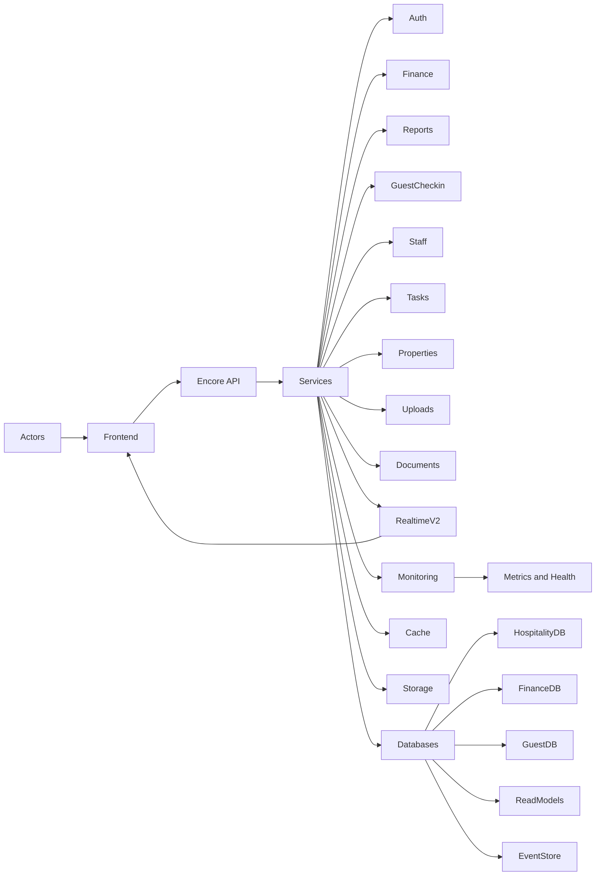

# Context — Hospitality Management Platform

Last updated: 2025-12-09

## Purpose
This document provides product and technical context so teams can understand the why, who, and constraints behind the system, grounded in live metadata and code references.

## Current work focus
- MCP server setup and configuration for live inspection
- Memory bank initialization and verification
- Ongoing maintenance and observability improvements

## Recent changes
- Encore MCP server configured in .kilocode/mcp.json (2025-12-13)
- Memory bank files verified and up to date
- All API versioning and streaming implementation complete

## Next steps
- Monitor system health and performance metrics
- Plan for production deployment optimizations
- Consider additional features based on user feedback

## Snapshot
- **Services:** 29
- **Endpoints:** 608
- **Databases:** 7
- **Storage buckets:** 5
- **Realtime:** v2 unified streaming; v1 long-poll compatibility

## Who this serves
- **Organization admins:** configure org, properties, branding, access.
- **Property managers:** operate daily finance, reports, approvals, tasks, staff.
- **Front desk staff:** guest check-in, document intake, verifications, tasks.
- **Finance reviewers:** approvals, reconciliation, exports, auditability.
- **Executives and owners:** monthly and yearly summaries, dashboards.

## Core goals
- Single operational surface for multi-tenant hospitality orgs.
- Finance-grade auditability, approvals, and consistent reporting.
- Real-time UX where it matters, without overloading the backend.
- Strong privacy posture for guest identity and document handling.
- Operable and observable: clear health, metrics, and scheduled maintenance.

## Out of scope
- Payment gateway integrations and OTA marketplace integrations are placeholders only.
- Advanced revenue management and pricing optimization are not included.

## System context at a glance

### Key domain contexts
- Auth and access: central gateway auth with JWT and refresh rotation. See [backend/auth/refresh.ts](backend/auth/refresh.ts).
- Finance operations: partitioned tables, approvals, notifications, summaries. See [backend/finance](backend/finance).
- Reporting: daily and monthly reports, reconciliation, exports. See [backend/reports](backend/reports) and [DOCUMENT_EXPORT_IMPLEMENTATION.md](DOCUMENT_EXPORT_IMPLEMENTATION.md).
- Guest check-in: check-ins, document capture, extraction-only flows, audit signals. See [backend/guest-checkin](backend/guest-checkin).
- Staff and tasks: attendance, leave, schedules, task attachments and images. See [backend/staff](backend/staff) and [backend/tasks](backend/tasks).

## Key domain contexts
' : listkeit weg nach überarbeitung (khan nur als md references eingemergt)
- Primary application data in hospitality database: orgs, users, properties, staff, tasks, files, notifications, approvals, bookings, daily_cash_balances.
- Finance database: quarterly-partitioned revenues and expenses with event mirrors for audit.
- Guest checkin database: guest_checkins, guest_documents, guest_audit_logs with verification state.
- Read models: pre-aggregated projections enabling fast dashboards.
- Event store: append-only domain events enabling reconstruction and audits.
- Health check database: minimal schema supporting readiness and liveness.
See app configuration at [backend/encore.app](backend/encore.app).
' : veraltet

## Storage context
- receipts: private signed URLs, path {orgId}/{filename}; finance receipts.
- guest-documents: private signed URLs, path {orgId}/{guestCheckInId}/{filename}; identity documents.
- task-images: public CDN; task reference images.
- logos: public CDN; organization logos.
- document-exports: private signed URLs with 1-hour expiry; auto-cleaned by cron.

## Realtime context
- Unified v2 stream multiplexes events with dynamic subscriptions and credit flow control.
- Long-poll v1 endpoints remain for incremental adoption.
- Client guidance and patterns: [README_STREAMING_API.md](README_STREAMING_API.md), [docs/REALTIME_PROVIDER_FINANCE.md](docs/REALTIME_PROVIDER_FINANCE.md).
- Core server implementation anchor: [backend/realtime/connection_pool.ts](backend/realtime/connection_pool.ts).

Caching and performance context
- L1 in-process caching; explicit invalidation and metrics endpoints.
- Cache warming cron for high-traffic orgs; per-org warming on 6-hour cadence.
- Partitioned finance tables keep p95 latencies low on time-series data.
- Targets: GET p95 < 500ms; stream delivery p95 < 1s under nominal load.
See [docs/NETWORKING_AND_REALTIME_IMPROVEMENTS.md](docs/NETWORKING_AND_REALTIME_IMPROVEMENTS.md).

Security and privacy context
- JWT-based auth, RBAC with org and property scoping at endpoint boundaries.
- PII minimization and controlled retention for documents; extraction-only patterns to avoid unnecessary cloud storage. See [CLIENT_SIDE_STORAGE_IMPLEMENTATION.md](CLIENT_SIDE_STORAGE_IMPLEMENTATION.md) and [FILE_UPLOAD_SIZE_LIMITS.md](FILE_UPLOAD_SIZE_LIMITS.md).
- Immutable audit trails across finance and guest domains.

Observability and operations context
- Health, readiness, liveness, unified health, and detailed metrics under monitoring.
- Partition and replica verification utilities: [backend/monitoring/verify_partitions.ts](backend/monitoring/verify_partitions.ts).
- Cron schedule highlights:
  - Cache warming every 5m; stats hourly.
  - Night audit 5 AM.
  - Document export cleanup 2 AM.
  - Daily data consistency 2 AM.
  - Partition maintenance 1st 2 AM; optional cleanup 15th 3 AM.
  - Task reminders every 5m.

API versioning context
- REST under /v1 with legacy routes preserved during migration windows.
- Streaming under /v2 to decouple transport concerns from REST versioning.
- Full route catalog: [docs/API_COMPLETE_REFERENCE.md](docs/API_COMPLETE_REFERENCE.md).

Development context
- Run local backend: bun with Encore managed app. See [QUICKSTART.md](QUICKSTART.md).
- Use encore-mcp tools for live inspection and documentation generation:
  - Services and endpoints inventory: get_services.
  - Databases and tables: get_databases.
  - Storage buckets: get_storage_buckets.
  - Auth handlers and middleware: get_auth_handlers, get_middleware.
  - Cron jobs and cache keyspaces: get_cronjobs, get_cache_keyspaces.
- MCP diagnosis and health: [ENCORE_MCP_SERVER_DIAGNOSIS.md](ENCORE_MCP_SERVER_DIAGNOSIS.md).

Constraints and assumptions
- Multi-tenant model: org and property scoping enforced across domains.
- Backward compatibility maintained for a migration window.
- Public CDN only for non-sensitive assets; sensitive documents use signed URLs.

Risks and mitigations
- Long-poll fallbacks can increase DB load under high churn; unified stream reduces polling.
- Export artifacts can grow rapidly; lifecycle cleanup and expiry mitigate storage pressure.
- Partition management drift; monitoring endpoints verify setup and health.

Glossary
- V1 REST: versioned HTTP endpoints standardized under /v1.
- V2 Realtime: unified streaming service with multiplexing and credit flow control.
- Read models: pre-aggregated tables optimized for fast query paths.
- Extraction-only: client transfers document content to storage without server retention where possible.

Source-of-truth and regeneration
- Treat encore-mcp as canonical for inventories and schemas; regenerate counts before releases.
- Keep docs synchronized with [docs/API_COMPLETE_REFERENCE.md](docs/API_COMPLETE_REFERENCE.md) and code anchors.

Key references
- Architecture: [.kilocode/rules/memory-bank/architecture.md](.kilocode/rules/memory-bank/architecture.md)
- Technical doc: [.kilocode/rules/memory-bank/tech.md](.kilocode/rules/memory-bank/tech.md)
- Product brief: [.kilocode/rules/memory-bank/brief.md](.kilocode/rules/memory-bank/brief.md)
- Realtime: [README_STREAMING_API.md](README_STREAMING_API.md), [docs/REALTIME_PROVIDER_FINANCE.md](docs/REALTIME_PROVIDER_FINANCE.md)
- Exports: [DOCUMENT_EXPORT_IMPLEMENTATION.md](DOCUMENT_EXPORT_IMPLEMENTATION.md)
- Monitoring: [backend/monitoring/verify_partitions.ts](backend/monitoring/verify_partitions.ts)
- Realtime core: [backend/realtime/connection_pool.ts](backend/realtime/connection_pool.ts)
- Auth refresh: [backend/auth/refresh.ts](backend/auth/refresh.ts)
- App config: [backend/encore.app](backend/encore.app)

Kilo Code process notes
- One tool per step; confirm success before continuing.
- Discover-first: use codebase semantic search and encore-mcp before edits.
- Surgical edits for existing code; full writes for new docs; keep links clickable.
- Prefer a single clear Mermaid diagram with simple labels.

End of document.