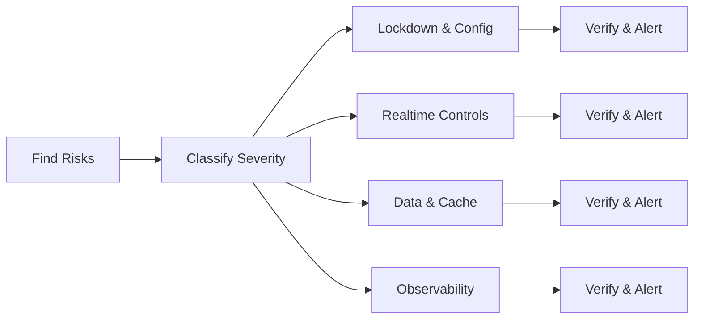

# Risks & Improvements Memory Bank — Hospitality Management Platform

Last updated: 2025-12-13
Source-of-truth: Encore MCP live inventory and code anchors

## Executive Summary

MCP inventory confirms 30 services and 609 endpoints across 7 databases and 5 storage buckets. Overall architecture is solid, with partitioned finance tables, sensible storage privacy defaults, and realtime backpressure implemented. Primary risks are overexposed PUBLIC/diagnostic endpoints, overly broad CORS and HTTP body limits, and incomplete enterprise features in realtime (batching/compression/limits/metrics). This entry stores the audit for continuity and execution planning.

## Live Inventory Snapshot

- Services: 30
- Endpoints: 609
- Databases: 7
- Storage buckets: 5
- Auth gateway: single handler in auth service
- Cron jobs: cache warming, partitions, consistency checks, night audit, document cleanup, task reminders

Key anchors
- App config: [backend/encore.app](backend/encore.app:5)
- Realtime core: [backend/realtime/connection_pool.ts](backend/realtime/connection_pool.ts:66), [backend/realtime/connection_pool.ts](backend/realtime/connection_pool.ts:229), [backend/realtime/connection_pool.ts](backend/realtime/connection_pool.ts:262)
- Frontend realtime backoff: [frontend/providers/RealtimeProviderV2_Fixed.tsx](frontend/providers/RealtimeProviderV2_Fixed.tsx:880)
- Realtime/networking guide: [docs/NETWORKING_AND_REALTIME_IMPROVEMENTS.md](docs/NETWORKING_AND_REALTIME_IMPROVEMENTS.md)
- Upload size guidance: [FILE_UPLOAD_SIZE_LIMITS.md](FILE_UPLOAD_SIZE_LIMITS.md)
- Partitions verification utility: [backend/monitoring/verify_partitions.ts](backend/monitoring/verify_partitions.ts)
- MCP diagnosis: [ENCORE_MCP_SERVER_DIAGNOSIS.md](ENCORE_MCP_SERVER_DIAGNOSIS.md)

## Risks (with evidence) and Mitigations

1) Overexposed operational and debug endpoints
- Evidence: Multiple PUBLIC debug/diagnostic endpoints in auth (/v1/auth/debug/*) and finance (init/migration/schema-check, including a no-auth migration route). Risk of information disclosure and DB tampering.
- Mitigation: Convert to AUTH+ADMIN or PRIVATE; remove “no-auth” routes entirely; add per-IP rate limiting for any remaining diagnostic GETs.

2) Excessive HTTP body size and permissive CORS
- Evidence: HTTP max_body_size set to 500MB in [backend/encore.app](backend/encore.app:5); broad allow_origins_with_credentials including many localhost ports and a third-party domain in [backend/encore.app](backend/encore.app:18).
- Mitigation: Lower global max_body_size to domain-appropriate caps (e.g., 18–32MB for uploads; 2–5MB default for JSON). Split CORS allowlists per environment; restrict credentials list to official staging/prod frontends.

3) Realtime enterprise guardrails incomplete
- Evidence: Backpressure and quarantine present in [backend/realtime/connection_pool.ts](backend/realtime/connection_pool.ts:229); optional credit gating in [backend/realtime/connection_pool.ts](backend/realtime/connection_pool.ts:262); client backoff/jitter in [frontend/providers/RealtimeProviderV2_Fixed.tsx](frontend/providers/RealtimeProviderV2_Fixed.tsx:880). Missing server-side batching, compression threshold usage, per-user connection limits, and richer delivery metrics.
- Mitigation: Implement adaptive batching (30–150 ms windows, max 100), optional compression for large batches, per-user connection cap (e.g., 10), org-level caps for stress, and export delivery SLOs (p50/p95, drops, quarantine, credits, conflation, bytes-saved) via /v2/realtime/metrics and mirrored under /v1/system/monitoring.

4) Cross-service data coupling via shared DB
- Evidence: Shared connection permits reports to read finance tables directly.
- Mitigation: Prefer read models or internal typed endpoints for isolation. If shared DB persists, enforce least-privilege, read-only role and schema contracts.

5) Metrics coverage gaps
- Evidence: Global metrics inventory via MCP returned empty. Some metrics exist via domain endpoints, but a unified baseline is needed.
- Mitigation: Ensure /v1/system/metrics/aggregated includes GET/POST p95, stream p95, cache hit rate, partitions readiness, replica lag; back these with dashboard tiles and alerts.

## Improvements (Prioritized)

P0 — Security and exposure
- Lock down PUBLIC operational endpoints in auth and finance to ADMIN or PRIVATE; remove no-auth migration endpoints.
- Reduce max_body_size in [backend/encore.app](backend/encore.app:5) and refine CORS allowlists by environment.

P1 — Realtime scale, cost, observability
- Add server-side batching and optional compression threshold in unified stream and [backend/realtime/connection_pool.ts](backend/realtime/connection_pool.ts:66).
- Enforce per-user connection caps and expose delivery SLO metrics; ensure metrics surface via /v2/realtime/metrics and /v1/system/monitoring.

P2 — Data access boundaries & cache
- Migrate sensitive report reads from shared DB to read models or internal endpoints; preserve shared DB as read-only if retained.
- Production cache: use Redis L3 now; phase-in Encore L2 when available; publish minimal keyspace inventory and invalidate-by-tag endpoints.

P3 — Observability & guardrails
- Ensure aggregated metrics and alerts cover streaming drops, quarantine spikes, partition mismatches, and replica lag. Link to dashboards in [backend/monitoring/MONITORING_DASHBOARDS.md](backend/monitoring/MONITORING_DASHBOARDS.md).

## Quick Wins (High impact, low effort)

- Remove or lock down PUBLIC finance init/migration/schema-check endpoints; restrict auth debug to ADMIN or PRIVATE.
- Tighten CORS and lower global body limits to sane defaults; keep upload paths explicitly configured per [FILE_UPLOAD_SIZE_LIMITS.md](FILE_UPLOAD_SIZE_LIMITS.md).
- Add per-user connection cap in realtime and begin emitting minimal delivery metrics.

## Implementation Plan (Actionable)

- [ ] Enforce ADMIN/PRIVATE access on auth debug and finance init/migration/schema-check endpoints; delete finance/run-migration-no-auth.
- [ ] Update [backend/encore.app](backend/encore.app:5) to reduce max_body_size; refine allow_origins_with_credentials to official frontends per environment.
- [ ] Implement adaptive batching and basic delivery SLO metrics in [backend/realtime/connection_pool.ts](backend/realtime/connection_pool.ts:66) and the unified stream server.
- [ ] Add per-user connection cap and surface drop/quarantine/latency counters via /v2/realtime/metrics.
- [ ] Reduce shared DB usage by moving reports toward read models/internal APIs; keep shared read-only where used.
- [ ] Configure Redis L3 in production; add minimal cache keyspace/metrics endpoints and invalidate-by-tag capability.

## Diagram — Risks to Remediation Flow

## Notes and Rationale

- Security posture: remove public routes that can modify schema or reveal sensitive internals. Keep debug behind ADMIN and rate limits. Favor PRIVATE for prod-only maintenance.
- Performance posture: prefer batching and optional compression to reduce bandwidth and tail latencies; enforce caps to prevent abusive clients.
- Isolation posture: reduce cross-service coupling to sustain independent scaling and schema evolution; favor read models.
- Operability posture: publish minimal, consistent metrics suites and dashboards; alert on regressions and drift (partitions and streams).

## Audit Trail (Source Anchors)

- App config: [backend/encore.app](backend/encore.app:5)
- Realtime backpressure & credits: [backend/realtime/connection_pool.ts](backend/realtime/connection_pool.ts:229), [backend/realtime/connection_pool.ts](backend/realtime/connection_pool.ts:262)
- Client backoff with jitter: [frontend/providers/RealtimeProviderV2_Fixed.tsx](frontend/providers/RealtimeProviderV2_Fixed.tsx:880)
- Networking & realtime guide: [docs/NETWORKING_AND_REALTIME_IMPROVEMENTS.md](docs/NETWORKING_AND_REALTIME_IMPROVEMENTS.md)
- Upload size limits: [FILE_UPLOAD_SIZE_LIMITS.md](FILE_UPLOAD_SIZE_LIMITS.md)
- Partitions verification: [backend/monitoring/verify_partitions.ts](backend/monitoring/verify_partitions.ts)
- MCP diagnosis: [ENCORE_MCP_SERVER_DIAGNOSIS.md](ENCORE_MCP_SERVER_DIAGNOSIS.md)

