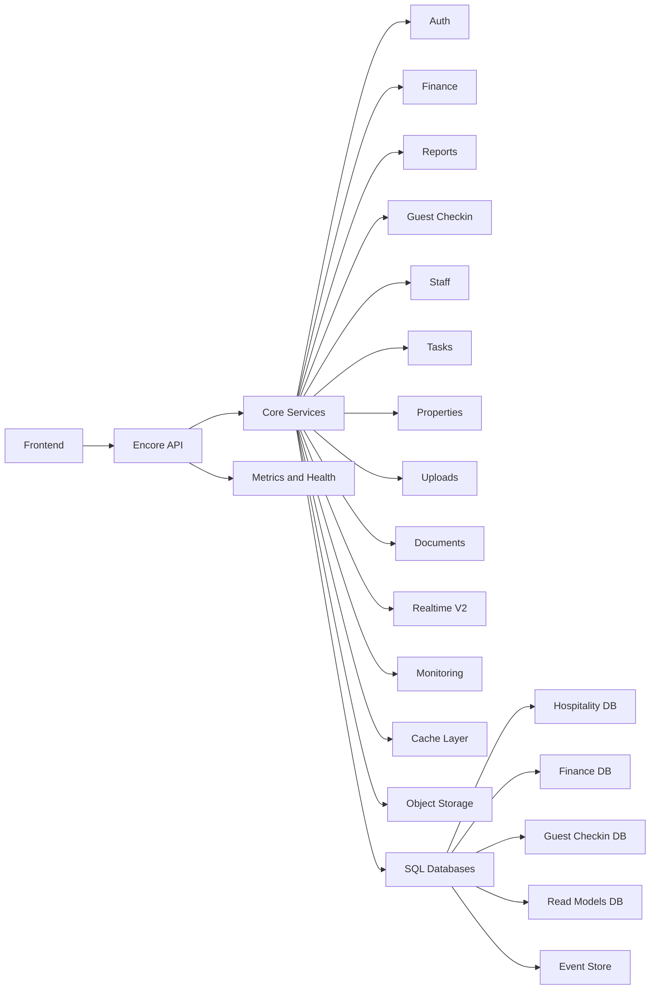

# Technical Documentation — Hospitality Management Platform (Concise)

Last updated: 2025-12-09
Source of truth: encore-mcp live metadata. MCP config: [`.kilocode/mcp.json`](.kilocode/mcp.json). Architecture reference: [`.kilocode/rules/memory-bank/architecture.md`](.kilocode/rules/memory-bank/architecture.md)

## Live inventory snapshot
- Services: 29
- Endpoints: 608
- Databases: 7
- Storage buckets: 5
- Realtime: v2 unified streaming plus v1 long-poll endpoints

## System overview
The platform is a modular Encore application providing typed endpoints, service discovery, managed SQL databases, and object storage. Core business domains include auth, finance, reports, guest-checkin, staff, properties, tasks, users, uploads, and documents. Infrastructure domains cover monitoring, realtime, database, cache, communication, config, cron, orgs, validation, and telemetry.

## Diagram

## Services and API versioning
- All REST endpoints are standardized under the /v1 prefix while legacy routes remain during migration windows.
- Streaming is consolidated under /v2 realtime with flow control and dynamic subscription updates.
- The complete route inventory is available in [`docs/API_COMPLETE_REFERENCE.md`](docs/API_COMPLETE_REFERENCE.md).

## Data stores
- Hospitality database: multi-tenant application data for auth, orgs, properties, staff, tasks, users, files, notifications, approvals, bookings, and daily_cash_balances.
- Finance database: partitioned revenues and expenses tables by quarter with event store mirrors, optimized for auditability and performance.
- Guest checkin database: guest_checkins, guest_documents, and guest_audit_logs with extraction and verification metadata.
- Read models: pre-aggregated projections for fast dashboard queries.
- Event store: append-only events for reconstruction and audit trails.
- Health check database: minimal schema for liveness and readiness checks.
Database configs and wiring are managed by Encore; see app config at [`backend/encore.app`](backend/encore.app).

## Realtime and subscriptions
- Unified streaming endpoints:
  - GET v2/realtime/stream
  - GET v2/realtime/metrics
  - POST v2/realtime/credits and v2/realtime/update-services
- Domain long-poll endpoints remain for backward compatibility under /v1 paths.
Core implementation anchor: [`backend/realtime/connection_pool.ts`](backend/realtime/connection_pool.ts). Additional notes: [`README_STREAMING_API.md`](README_STREAMING_API.md) and [`docs/REALTIME_PROVIDER_FINANCE.md`](docs/REALTIME_PROVIDER_FINANCE.md).