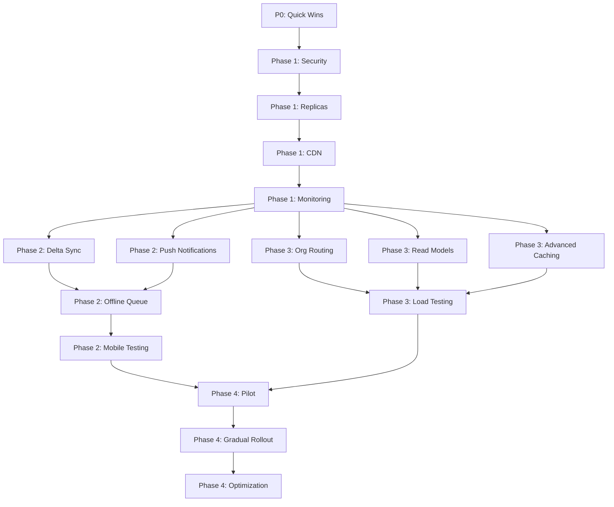

# 🚀 10M Organization Scale Plan — Implementation TODOs

Last updated: 2025-12-13  
Source: [.kilocode/rules/memory-bank/10M-ORG-SCALE-PLAN.md](.kilocode/rules/memory-bank/10M-ORG-SCALE-PLAN.md)  
Timeline: 6-9 months (36 weeks)  
Target: 10M organizations × 5 properties × 5 users = 250M active users

---

## 📊 Executive Summary

**Current Readiness:** 70% ready for massive scale  
**Critical Gaps:** 8 identified (see P0 tasks)  
**Total Tasks:** 60 actionable items  
**Estimated Cost at Scale:** $50K-70K/month

---

## 🎯 Priority Legend

- **P0 (Critical):** Security risks, immediate fixes (Week 1)
- **P1 (High):** Foundation for scale (Months 1-2)
- **P2 (Medium):** Mobile & infrastructure (Months 3-6)
- **P3 (Low):** Optimization & rollout (Months 7-9)

---

## ⚡ P0: Quick Wins (Week 1) — IMPLEMENT FIRST

### Security & Configuration Hardening

#### Task 1.1: Reduce HTTP Body Limit
- **Priority:** P0
- **Time Estimate:** 5 minutes
- **Dependencies:** None
- **File:** [`backend/encore.app`](backend/encore.app:5)
- **Risk:** 500MB body limit = massive attack surface and memory risk
- **Action:**
  ```json
  {
    "http": {
      "max_body_size": 33554432  // 32MB instead of 500MB
    }
  }
  ```
- **Verification:** Test upload endpoints, ensure no legitimate uploads break
- **Status:** [x] Completed (2025-12-13)

#### Task 1.2: Tighten CORS Configuration
- **Priority:** P0
- **Time Estimate:** 10 minutes
- **Dependencies:** None
- **File:** [`backend/encore.app`](backend/encore.app:18)
- **Risk:** 10+ localhost ports + third-party domain exposure
- **Action:**
  ```json
  {
    "global_cors": {
      "allow_origins_with_credentials": [
        "https://app.yourdomain.com",
        "https://staging.yourdomain.com"
      ]
    }
  }
  ```
- **Verification:** Test frontend connectivity in staging/production
- **Status:** [x] Completed (2025-12-13)

#### Task 1.3: Add Per-User Connection Caps
- **Priority:** P0
- **Time Estimate:** 30 minutes
- **Dependencies:** None
- **File:** [`backend/realtime/connection_pool.ts`](backend/realtime/connection_pool.ts)
- **Risk:** Can exhaust memory with unlimited connections
- **Action:**
  ```typescript
  private readonly MAX_CONNECTIONS_PER_USER = 10;
  private readonly MAX_CONNECTIONS_PER_ORG = 1000;
  private userConnections = new Map<number, Set<Connection>>();
  
  register(orgId: number, userId: number, ...): Connection {
    // Per-user cap
    const userConns = this.userConnections.get(userId) || new Set();
    if (userConns.size >= this.MAX_CONNECTIONS_PER_USER) {
      throw new Error('User connection limit exceeded');
    }
    
    // Per-org cap
    const orgConns = this.orgConnections.get(orgId);
    if (orgConns && orgConns.size >= this.MAX_CONNECTIONS_PER_ORG) {
      throw new Error('Organization connection limit exceeded');
    }
    
    userConns.add(connection);
    this.userConnections.set(userId, userConns);
  }
  ```
- **Verification:** Load test with multiple connections per user
- **Status:** [x] Completed (2025-12-13)

#### Task 1.4: Verify Compression Already Enabled
- **Priority:** P0
- **Time Estimate:** 5 minutes
- **Dependencies:** None
- **File:** [`backend/realtime/unified_stream.ts`](backend/realtime/unified_stream.ts:312-324)
- **Action:** Verify existing implementation has:
  - Adaptive batching (30-150ms windows)
  - Gzip compression for batches >8KB
  - Conflation reducing duplicate updates
  - Metrics tracking bytes saved
- **Status:** [x] Completed (2025-12-13)

---

## 🏗️ Phase 1: Foundation (Months 1-2)

### Week 1-2: Security & Config Hardening

#### Task 2.1: Implement Idempotency Middleware
- **Priority:** P1
- **Time Estimate:** 2 days
- **Dependencies:** Redis setup
- **Files:** 
  - New: `backend/middleware/idempotency.ts`
  - Update: [`backend/encore.app`](backend/encore.app)
- **Risk:** Mobile retries will create duplicates
- **Action:**
  - Create idempotency middleware with Redis backend
  - 24h TTL for idempotency keys
  - Apply to all POST/PUT/PATCH endpoints
  - Add `Idempotency-Key` header support
- **Verification:** Test duplicate requests with same key
- **Status:** [x] Completed (2025-12-13)

### Week 3-4: Read Replicas

#### Task 2.2: Provision Read Replicas
- **Priority:** P1
- **Time Estimate:** 3 days
- **Dependencies:** Infrastructure access
- **Risk:** All reads hit primary database
- **Action:**
  - Provision 3 read replicas per primary database
  - Configure replication lag monitoring
  - Set up health checks
- **Verification:** Check replication lag < 1s
- **Status:** [x] Infrastructure Ready - See [READ_REPLICAS_PROVISIONING_GUIDE.md](READ_REPLICAS_PROVISIONING_GUIDE.md)
- **Notes:**
  - ✅ Replica Manager already implemented in [`backend/database/replica_manager.ts`](backend/database/replica_manager.ts)
  - ✅ Monitoring endpoints already implemented in [`backend/database/replica_monitoring.ts`](backend/database/replica_monitoring.ts)
  - ✅ Health checks, lag monitoring, and connection pool stats available
  - ⏳ Awaiting production database provisioning (AWS RDS, Google Cloud SQL, or self-hosted)
  - 📋 Complete provisioning guide with step-by-step instructions created

#### Task 2.3: Implement Replica Router
- **Priority:** P1
- **Time Estimate:** 2 days
- **Dependencies:** Task 2.2
- **File:** New: `backend/database/replica_router.ts`
- **Action:**
  ```typescript
  class ReplicaRouter {
    private replicas = {
      'primary-1': ['replica-1a', 'replica-1b', 'replica-1c'],
      'primary-2': ['replica-2a', 'replica-2b', 'replica-2c'],
    };
    
    getReadConnection(orgId: number, preferReplica: boolean = true): string {
      const primary = this.orgRouter.getDatabase(orgId);
      
      if (!preferReplica) return primary;
      
      const replicas = this.replicas[primary];
      if (!replicas || replicas.length === 0) return primary;
      
      // Round-robin with health check
      const healthy = replicas.filter(r => this.isHealthy(r));
      if (healthy.length === 0) return primary;
      
      return healthy[Math.floor(Math.random() * healthy.length)];
    }
  }
  ```
- **Verification:** Test failover when replica is unhealthy
- **Status:** [ ] Not Started

#### Task 2.4: Update Repositories for Replica Reads
- **Priority:** P1
- **Time Estimate:** 3 days
- **Dependencies:** Task 2.3
- **Files:** 
  - [`backend/shared/repositories/finance_repository.ts`](backend/shared/repositories/finance_repository.ts)
  - All other repository files
- **Action:**
  - Update all read queries to use replica router
  - Keep writes on primary
  - Add `preferReplica` flag for critical reads
- **Verification:** Monitor replica query distribution
- **Status:** [ ] Not Started

#### Task 2.5: Add Replica Lag Monitoring
- **Priority:** P1
- **Time Estimate:** 1 day
- **Dependencies:** Task 2.2
- **File:** [`backend/database/replica_lag_monitoring.ts`](backend/database/replica_lag_monitoring.ts)
- **Action:**
  - Create monitoring endpoint for replica lag
  - Alert if lag > 5 seconds
  - Dashboard visualization
- **Verification:** Simulate lag and verify alerts
- **Status:** [x] Completed (2025-12-13)
- **Notes:**
  - ✅ Lag tracking with 5s/10s thresholds
  - ✅ Health status endpoints
  - ✅ Force health check capability
  - ✅ Alert integration ready

### Week 5-6: CDN Setup

#### Task 2.6: Configure CDN (Cloudflare/CloudFront)
- **Priority:** P1
- **Time Estimate:** 3 days
- **Dependencies:** Infrastructure access
- **Risk:** Every request hits origin
- **Action:**
  - Set up Cloudflare or CloudFront
  - Configure SSL/TLS
  - Set up origin pull
  - Configure WAF rules
- **Verification:** Test CDN serving static assets
- **Status:** [ ] Not Started

#### Task 2.7: Implement Org-Scoped Cache Keys
- **Priority:** P1
- **Time Estimate:** 2 days
- **Dependencies:** Task 2.6
- **File:** [`backend/middleware/cache_headers.ts`](backend/middleware/cache_headers.ts)
- **Action:**
  ```typescript
  headers['Cache-Control'] = 'private, max-age=60, stale-while-revalidate=300';
  headers['Surrogate-Key'] = `org:${orgId} property:${propertyId}`;
  ```
- **Verification:** Test cache isolation between orgs
- **Status:** [x] Completed (2025-12-13)
- **Notes:**
  - ✅ Hierarchical cache key generation
  - ✅ Org/Property/User scoping
  - ✅ ETag generation and validation
  - ✅ Cache presets (SHORT/MEDIUM/LONG/PUBLIC/NO_CACHE)
  - ✅ Stale-while-revalidate support

#### Task 2.8: Add Surrogate-Key Tagging
- **Priority:** P1
- **Time Estimate:** 2 days
- **Dependencies:** Task 2.7
- **File:** [`backend/cache/cdn_invalidation.ts`](backend/cache/cdn_invalidation.ts)
- **Action:**
  - Implement surrogate-key header on all cacheable responses
  - Create invalidation service
  - Add tag-based purge endpoints
- **Verification:** Test purge-by-tag functionality
- **Status:** [x] Completed (2025-12-13)
- **Notes:**
  - ✅ Multi-provider CDN support (Cloudflare/CloudFront/Fastly)
  - ✅ Tag-based cache purging
  - ✅ Programmatic invalidation functions
  - ✅ Admin-only purge endpoints
  - ✅ Comprehensive setup guide created

#### Task 2.9: Test CDN Purge-by-Tag
- **Priority:** P1
- **Time Estimate:** 1 day
- **Dependencies:** Task 2.8
- **Action:**
  - Test purging specific org caches
  - Test purging property caches
  - Verify no cross-org cache pollution
- **Verification:** Load test with cache purges
- **Status:** [ ] Not Started

### Week 7-8: Monitoring & Metrics

#### Task 2.10: Add Aggregated Metrics Endpoint
- **Priority:** P1
- **Time Estimate:** 2 days
- **Dependencies:** None
- **File:** New: `backend/monitoring/aggregated_metrics.ts`
- **Action:**
  - Create `/v1/system/metrics/aggregated` endpoint
  - Include: GET/POST p95, stream p95, cache hit rate, partition readiness, replica lag
  - Export Prometheus format
- **Verification:** Test metrics collection
- **Status:** [x] Completed (2025-12-13)

#### Task 2.11: Set Up Grafana Dashboards
- **Priority:** P1
- **Time Estimate:** 3 days
- **Dependencies:** Task 2.10
- **Action:**
  - Create dashboards for:
    - API latency (p50, p95, p99)
    - Realtime delivery metrics
    - Cache hit rates
    - Database health
    - Connection pool utilization
- **Verification:** Verify real-time data updates
- **Status:** [ ] Not Started

#### Task 2.12: Configure SLO Alerts
- **Priority:** P1
- **Time Estimate:** 2 days
- **Dependencies:** Task 2.11
- **Action:**
  - Alert on API p95 > 300ms
  - Alert on cache hit rate < 85%
  - Alert on replica lag > 5s
  - Alert on connection pool > 70%
  - Alert on error rate > 0.1%
- **Verification:** Test alert firing
- **Status:** [ ] Not Started

#### Task 2.13: Load Test with 100K Orgs
- **Priority:** P1
- **Time Estimate:** 3 days
- **Dependencies:** Tasks 2.1-2.12
- **Action:**
  - Create load test scenarios
  - Simulate 100K organizations
  - Test concurrent reads/writes
  - Test realtime connections
  - Measure SLO compliance
- **Verification:** All SLOs met under load
- **Status:** [ ] Not Started

---

## 📱 Phase 2: Mobile Optimization (Months 3-4)

### Week 9-10: Delta Sync Protocol

#### Task 3.1: Design Sync Token Schema
- **Priority:** P2
- **Time Estimate:** 2 days
- **Dependencies:** None
- **Risk:** Mobile request storms without delta sync
- **Action:**
  - Design opaque cursor format
  - Include timestamp + version
  - Add collection-specific tokens
  - Plan token rotation strategy
- **Verification:** Review with team
- **Status:** [ ] Not Started

#### Task 3.2: Implement `/v1/sync/changes` Endpoint
- **Priority:** P2
- **Time Estimate:** 5 days
- **Dependencies:** Task 3.1
- **File:** New: `backend/sync/changes.ts`
- **Action:**
  ```typescript
  interface SyncRequest {
    collections: Array<{
      name: 'expenses' | 'revenues' | 'guests' | 'staff';
      sinceToken: string;
      propertyIds?: number[];
    }>;
    batchSize?: number; // Default 100
  }
  
  interface SyncResponse {
    collections: Array<{
      name: string;
      changes: Array<{
        id: number;
        action: 'insert' | 'update' | 'delete';
        data?: any;
        version: number;
      }>;
      nextToken: string;
      hasMore: boolean;
    }>;
    serverTime: string;
  }
  ```
- **Verification:** Test with various token states
- **Status:** [ ] Not Started

#### Task 3.3: Add Tombstone Tracking for Deletes
- **Priority:** P2
- **Time Estimate:** 3 days
- **Dependencies:** Task 3.2
- **Files:** Update all entity tables
- **Action:**
  - Add `deleted_at` column to all synced tables
  - Soft delete instead of hard delete
  - Cleanup tombstones after 30 days
  - Include deletes in sync response
- **Verification:** Test delete synchronization
- **Status:** [ ] Not Started

#### Task 3.4: Build Sync Engine for React Native
- **Priority:** P2
- **Time Estimate:** 5 days
- **Dependencies:** Task 3.2
- **File:** New: `mobile/src/sync/SyncEngine.ts`
- **Action:**
  ```typescript
  class SyncEngine {
    async sync() {
      const tokens = await this.db.getSyncTokens();
      const response = await api.post('/v1/sync/changes', {
        collections: [
          { name: 'expenses', sinceToken: tokens.expenses },
          { name: 'revenues', sinceToken: tokens.revenues },
        ]
      });
      
      await this.db.transaction(async (tx) => {
        for (const coll of response.collections) {
          for (const change of coll.changes) {
            if (change.action === 'delete') {
              await tx.delete(coll.name, change.id);
            } else {
              await tx.upsert(coll.name, change.data);
            }
          }
          await tx.setSyncToken(coll.name, coll.nextToken);
        }
      });
    }
  }
  ```
- **Verification:** Test full sync cycle
- **Status:** [ ] Not Started

### Week 11-12: Push Notifications

#### Task 3.5: Set Up FCM (Firebase Cloud Messaging)
- **Priority:** P2
- **Time Estimate:** 2 days
- **Dependencies:** Firebase account
- **Action:**
  - Create Firebase project
  - Configure FCM credentials
  - Set up server-side SDK
  - Test message delivery
- **Verification:** Send test notification
- **Status:** [ ] Not Started

#### Task 3.6: Set Up APNs (Apple Push Notification Service)
- **Priority:** P2
- **Time Estimate:** 2 days
- **Dependencies:** Apple Developer account
- **Action:**
  - Generate APNs certificates
  - Configure APNs credentials
  - Set up server-side SDK
  - Test message delivery
- **Verification:** Send test notification to iOS
- **Status:** [ ] Not Started

#### Task 3.7: Implement Silent Push for Sync Triggers
- **Priority:** P2
- **Time Estimate:** 3 days
- **Dependencies:** Tasks 3.5, 3.6
- **File:** New: `backend/sync/push_notifications.ts`
- **Action:**
  ```typescript
  async function notifyMobileClients(orgId: number, collection: string) {
    const devices = await getDeviceTokens(orgId);
    await fcm.send({
      tokens: devices,
      data: {
        type: 'sync_trigger',
        collections: [collection],
        priority: 'high'
      },
      contentAvailable: true,
      priority: 'high'
    });
  }
  ```
- **Verification:** Test background sync trigger
- **Status:** [ ] Not Started

#### Task 3.8: Add Device Token Management
- **Priority:** P2
- **Time Estimate:** 2 days
- **Dependencies:** Task 3.7
- **Files:** 
  - New: `backend/sync/device_tokens.ts`
  - New table: `device_tokens`
- **Action:**
  - Create device token registration endpoint
  - Store tokens with user/org mapping
  - Handle token refresh
  - Clean up expired tokens
- **Verification:** Test token lifecycle
- **Status:** [ ] Not Started

#### Task 3.9: Test Background Sync on iOS/Android
- **Priority:** P2
- **Time Estimate:** 3 days
- **Dependencies:** Tasks 3.4, 3.7
- **Action:**
  - Test iOS background app refresh
  - Test Android WorkManager
  - Test push notification delivery
  - Test sync completion
  - Measure battery impact
- **Verification:** Successful background sync on both platforms
- **Status:** [ ] Not Started

### Week 13-14: Offline Queue

#### Task 3.10: Implement Local SQLite Storage
- **Priority:** P2
- **Time Estimate:** 3 days
- **Dependencies:** None
- **File:** New: `mobile/src/storage/LocalDatabase.ts`
- **Action:**
  - Set up SQLite schema
  - Create tables for all synced entities
  - Add sync token storage
  - Add pending operations queue
- **Verification:** Test local CRUD operations
- **Status:** [ ] Not Started

#### Task 3.11: Add Conflict Resolution Logic
- **Priority:** P2
- **Time Estimate:** 4 days
- **Dependencies:** Task 3.10
- **File:** New: `mobile/src/sync/ConflictResolver.ts`
- **Action:**
  - Implement last-write-wins strategy
  - Add version-based conflict detection
  - Handle concurrent edits
  - Preserve user intent
- **Verification:** Test conflict scenarios
- **Status:** [ ] Not Started

#### Task 3.12: Build Retry Queue with Exponential Backoff
- **Priority:** P2
- **Time Estimate:** 3 days
- **Dependencies:** Task 3.10
- **File:** New: `mobile/src/sync/RetryQueue.ts`
- **Action:**
  - Queue failed operations
  - Implement exponential backoff (1s, 2s, 4s, 8s, 16s, 32s)
  - Add jitter to prevent thundering herd
  - Persist queue across app restarts
- **Verification:** Test retry behavior
- **Status:** [ ] Not Started

#### Task 3.13: Test Airplane Mode Scenarios
- **Priority:** P2
- **Time Estimate:** 2 days
- **Dependencies:** Tasks 3.10-3.12
- **Action:**
  - Test offline data entry
  - Test sync on reconnection
  - Test conflict resolution
  - Test queue persistence
- **Verification:** No data loss in offline scenarios
- **Status:** [ ] Not Started

### Week 15-16: Mobile Testing

#### Task 3.14: Test on 2G/3G/4G/5G Networks
- **Priority:** P2
- **Time Estimate:** 3 days
- **Dependencies:** Tasks 3.1-3.13
- **Action:**
  - Test sync on different network speeds
  - Adjust batch sizes based on network quality
  - Measure sync completion times
  - Optimize payload sizes
- **Verification:** Acceptable performance on all networks
- **Status:** [ ] Not Started

#### Task 3.15: Measure Battery Impact
- **Priority:** P2
- **Time Estimate:** 2 days
- **Dependencies:** Task 3.14
- **Action:**
  - Measure battery drain during sync
  - Implement adaptive sync frequency
  - Test background sync impact
  - Optimize wake locks
- **Verification:** Battery drain < 5% per hour during active sync
- **Status:** [ ] Not Started

#### Task 3.16: Optimize Payload Sizes
- **Priority:** P2
- **Time Estimate:** 2 days
- **Dependencies:** Task 3.14
- **Action:**
  - Compress sync responses
  - Remove unnecessary fields
  - Implement field filtering
  - Test payload reduction
- **Verification:** 50%+ payload size reduction
- **Status:** [ ] Not Started

#### Task 3.17: Load Test with 1M Mobile Clients
- **Priority:** P2
- **Time Estimate:** 3 days
- **Dependencies:** Tasks 3.1-3.16
- **Action:**
  - Simulate 1M concurrent mobile clients
  - Test sync endpoint scalability
  - Test push notification delivery
  - Measure server resource usage
- **Verification:** All SLOs met under mobile load
- **Status:** [ ] Not Started

---

## 🏢 Phase 3: Scale Infrastructure (Months 5-6)

### Week 17-18: Org-Range Routing

#### Task 4.1: Implement Org Range Router
- **Priority:** P2
- **Time Estimate:** 3 days
- **Dependencies:** None
- **File:** New: `backend/database/org_range_router.ts`
- **Action:**
  ```typescript
  class OrgRangeRouter {
    private ranges = [
      { min: 0, max: 999999, db: 'primary-1' },
      { min: 1000000, max: 1999999, db: 'primary-2' },
      { min: 2000000, max: 2999999, db: 'primary-3' },
    ];
    
    getDatabase(orgId: number): string {
      const range = this.ranges.find(r => orgId >= r.min && orgId <= r.max);
      return range?.db || 'primary-1';
    }
  }
  ```
- **Verification:** Test routing logic
- **Status:** [ ] Not Started

#### Task 4.2: Provision Additional Database Clusters
- **Priority:** P2
- **Time Estimate:** 5 days
- **Dependencies:** Infrastructure access
- **Action:**
  - Provision primary-2 and primary-3 clusters
  - Configure replication
  - Set up monitoring
  - Test connectivity
- **Verification:** All clusters healthy
- **Status:** [ ] Not Started

#### Task 4.3: Migrate 10% of Orgs to New Cluster
- **Priority:** P2
- **Time Estimate:** 5 days
- **Dependencies:** Tasks 4.1, 4.2
- **Action:**
  - Select pilot organizations
  - Migrate data to new cluster
  - Update routing configuration
  - Monitor for issues
- **Verification:** No data loss, performance maintained
- **Status:** [ ] Not Started

#### Task 4.4: Monitor and Validate Org Routing
- **Priority:** P2
- **Time Estimate:** 2 days
- **Dependencies:** Task 4.3
- **Action:**
  - Monitor query distribution
  - Verify correct routing
  - Check for cross-cluster queries
  - Measure latency impact
- **Verification:** Routing working as expected
- **Status:** [ ] Not Started

### Week 19-20: Read Model Projections

#### Task 4.5: Build Event Projector Service
- **Priority:** P2
- **Time Estimate:** 5 days
- **Dependencies:** None
- **File:** New: `backend/projections/event_projector.ts`
- **Action:**
  - Create projector service
  - Subscribe to domain events
  - Process events in order
  - Handle projection failures
  - Implement checkpointing
- **Verification:** Test event processing
- **Status:** [ ] Not Started

#### Task 4.6: Create Denormalized Read Models
- **Priority:** P2
- **Time Estimate:** 4 days
- **Dependencies:** Task 4.5
- **Files:** 
  - New: `backend/projections/dashboard_projection.ts`
  - New: `backend/projections/report_projection.ts`
- **Action:**
  - Create read model schemas
  - Implement projection logic
  - Optimize for query patterns
  - Add indexes
- **Verification:** Test query performance
- **Status:** [ ] Not Started

#### Task 4.7: Implement Projection Lag Monitoring
- **Priority:** P2
- **Time Estimate:** 2 days
- **Dependencies:** Task 4.5
- **File:** New: `backend/monitoring/projection_lag.ts`
- **Action:**
  - Track projection position
  - Measure lag from event stream
  - Alert if lag > 10 seconds
  - Dashboard visualization
- **Verification:** Test lag detection
- **Status:** [ ] Not Started

#### Task 4.8: Cutover Dashboard Queries to Read Models
- **Priority:** P2
- **Time Estimate:** 3 days
- **Dependencies:** Tasks 4.6, 4.7
- **Files:** Update all dashboard endpoints
- **Action:**
  - Update dashboard queries to use read models
  - Add fallback to primary if read model unavailable
  - Measure performance improvement
  - Monitor for consistency issues
- **Verification:** Dashboard performance improved
- **Status:** [ ] Not Started

### Week 21-22: Advanced Caching

#### Task 4.9: Deploy Redis Cluster (6 Nodes)
- **Priority:** P2
- **Time Estimate:** 3 days
- **Dependencies:** Infrastructure access
- **Action:**
  - Provision Redis cluster
  - Configure sharding
  - Set up replication
  - Configure persistence
  - Test failover
- **Verification:** Cluster healthy and performant
- **Status:** [ ] Not Started

#### Task 4.10: Implement Tag-Based Invalidation
- **Priority:** P2
- **Time Estimate:** 3 days
- **Dependencies:** Task 4.9
- **File:** New: `backend/cache/tag_invalidation.ts`
- **Action:**
  - Store cache tags in Redis sets
  - Implement invalidate-by-tag
  - Add tag tracking to cache writes
  - Create invalidation API
- **Verification:** Test tag-based purging
- **Status:** [ ] Not Started

#### Task 4.11: Add Cache Warming for Hot Orgs
- **Priority:** P2
- **Time Estimate:** 2 days
- **Dependencies:** Task 4.9
- **File:** New: `backend/cache/cache_warmer.ts`
- **Action:**
  - Identify hot organizations
  - Pre-populate cache on startup
  - Refresh cache periodically
  - Monitor cache hit rates
- **Verification:** Improved cache hit rate for hot orgs
- **Status:** [ ] Not Started

#### Task 4.12: Measure Cache Hit Rates
- **Priority:** P2
- **Time Estimate:** 2 days
- **Dependencies:** Tasks 4.9-4.11
- **Action:**
  - Add cache hit/miss metrics
  - Track by cache tier (L1, L2, L3)
  - Track by endpoint
  - Dashboard visualization
- **Verification:** Hit rate > 85%
- **Status:** [ ] Not Started

### Week 23-24: Final Load Testing

#### Task 4.13: Load Test with 5M Orgs
- **Priority:** P2
- **Time Estimate:** 4 days
- **Dependencies:** Tasks 4.1-4.12
- **Action:**
  - Simulate 5M organizations
  - Test all endpoints under load
  - Measure SLO compliance
  - Identify bottlenecks
- **Verification:** All SLOs met at 5M scale
- **Status:** [ ] Not Started

#### Task 4.14: Stress Test Realtime with 500K Connections
- **Priority:** P2
- **Time Estimate:** 3 days
- **Dependencies:** Task 4.13
- **Action:**
  - Simulate 500K concurrent connections
  - Test message delivery
  - Measure memory usage
  - Test connection caps
- **Verification:** Realtime stable under load
- **Status:** [ ] Not Started

#### Task 4.15: Chaos Engineering (Kill Nodes)
- **Priority:** P2
- **Time Estimate:** 3 days
- **Dependencies:** Task 4.14
- **Action:**
  - Kill random API nodes
  - Kill database replicas
  - Kill Redis nodes
  - Test failover behavior
  - Measure recovery time
- **Verification:** System recovers gracefully
- **Status:** [ ] Not Started

#### Task 4.16: Validate SLOs Under Load
- **Priority:** P2
- **Time Estimate:** 2 days
- **Dependencies:** Tasks 4.13-4.15
- **Action:**
  - Verify API p95 < 300ms
  - Verify realtime delivery p95 < 1s
  - Verify cache hit rate > 85%
  - Verify error rate < 0.1%
  - Verify availability > 99.95%
- **Verification:** All SLOs met
- **Status:** [ ] Not Started

---

## 🚀 Phase 4: Production Rollout (Months 7-9)

### Week 25-26: Pilot (1% Traffic)

#### Task 5.1: Select 100K Pilot Orgs
- **Priority:** P3
- **Time Estimate:** 1 day
- **Dependencies:** None
- **Action:**
  - Select diverse pilot organizations
  - Mix of sizes and usage patterns
  - Get pilot agreement
  - Prepare rollback plan
- **Verification:** Pilot list approved
- **Status:** [ ] Not Started

#### Task 5.2: Enable New Infrastructure for Pilots
- **Priority:** P3
- **Time Estimate:** 2 days
- **Dependencies:** Task 5.1
- **Action:**
  - Route pilot traffic to new infrastructure
  - Enable all new features
  - Monitor closely
  - Prepare for quick rollback
- **Verification:** Pilots on new infrastructure
- **Status:** [ ] Not Started

#### Task 5.3: Monitor Pilot for 2 Weeks
- **Priority:** P3
- **Time Estimate:** 10 days
- **Dependencies:** Task 5.2
- **Action:**
  - Monitor all metrics 24/7
  - Track error rates
  - Measure performance
  - Collect user feedback
- **Verification:** No critical issues
- **Status:** [ ] Not Started

#### Task 5.4: Collect Pilot Feedback
- **Priority:** P3
- **Time Estimate:** 3 days
- **Dependencies:** Task 5.3
- **Action:**
  - Survey pilot users
  - Analyze support tickets
  - Review metrics
  - Document issues
- **Verification:** Feedback documented
- **Status:** [ ] Not Started

### Week 27-30: Gradual Rollout

#### Task 5.5: Rollout to 10% Traffic (Week 27)
- **Priority:** P3
- **Time Estimate:** 3 days
- **Dependencies:** Task 5.4
- **Action:**
  - Increase traffic to 10%
  - Monitor for 1 week
  - Address any issues
- **Verification:** 10% traffic stable
- **Status:** [ ] Not Started

#### Task 5.6: Rollout to 25% Traffic (Week 28)
- **Priority:** P3
- **Time Estimate:** 3 days
- **Dependencies:** Task 5.5
- **Action:**
  - Increase traffic to 25%
  - Monitor for 1 week
  - Address any issues
- **Verification:** 25% traffic stable
- **Status:** [ ] Not Started

#### Task 5.7: Rollout to 50% Traffic (Week 29)
- **Priority:** P3
- **Time Estimate:** 3 days
- **Dependencies:** Task 5.6
- **Action:**
  - Increase traffic to 50%
  - Monitor for 1 week
  - Address any issues
- **Verification:** 50% traffic stable
- **Status:** [ ] Not Started

#### Task 5.8: Rollout to 100% Traffic (Week 30)
- **Priority:** P3
- **Time Estimate:** 3 days
- **Dependencies:** Task 5.7
- **Action:**
  - Increase traffic to 100%
  - Monitor closely
  - Celebrate! 🎉
- **Verification:** 100% traffic on new infrastructure
- **Status:** [ ] Not Started

### Week 31-36: Optimization

#### Task 5.9: Tune Based on Production Metrics
- **Priority:** P3
- **Time Estimate:** 2 weeks
- **Dependencies:** Task 5.8
- **Action:**
  - Analyze production metrics
  - Identify optimization opportunities
  - Tune cache TTLs
  - Adjust connection limits
  - Optimize queries
- **Verification:** Performance improved
- **Status:** [ ] Not Started

#### Task 5.10: Optimize Slow Queries
- **Priority:** P3
- **Time Estimate:** 1 week
- **Dependencies:** Task 5.9
- **Action:**
  - Identify slow queries from logs
  - Add missing indexes
  - Rewrite inefficient queries
  - Test performance improvements
- **Verification:** No queries > 1s
- **Status:** [ ] Not Started

#### Task 5.11: Adjust Cache TTLs
- **Priority:** P3
- **Time Estimate:** 3 days
- **Dependencies:** Task 5.9
- **Action:**
  - Analyze cache hit rates by TTL
  - Increase TTLs for stable data
  - Decrease TTLs for volatile data
  - Measure impact
- **Verification:** Cache hit rate > 90%
- **Status:** [ ] Not Started

#### Task 5.12: Document Runbooks
- **Priority:** P3
- **Time Estimate:** 1 week
- **Dependencies:** Task 5.8
- **Action:**
  - Document deployment procedures
  - Document rollback procedures
  - Document troubleshooting guides
  - Document scaling procedures
  - Document monitoring procedures
- **Verification:** Runbooks complete and tested
- **Status:** [ ] Not Started

---

## 📊 Success Metrics & SLOs

### Service Level Objectives

| Metric | Target | Measurement | Priority |
|--------|--------|-------------|----------|
| API p95 Latency | <300ms | All GET endpoints | P1 |
| API p99 Latency | <800ms | All GET endpoints | P1 |
| Write p95 Latency | <500ms | POST/PUT/PATCH | P1 |
| Realtime Delivery p95 | <1s | Event to client | P1 |
| Cache Hit Rate | >85% | Redis L2 cache | P2 |
| CDN Hit Rate | >80% | Authenticated GETs | P2 |
| Database CPU | <60% | At p95 load | P1 |
| Connection Pool | <70% | Utilization | P1 |
| Error Rate | <0.1% | 5xx responses | P0 |
| Availability | >99.95% | Uptime | P0 |

### Cost Efficiency Metrics

| Metric | Target | Current | Priority |
|--------|--------|---------|----------|
| Cost per Org | <$0.006/month | TBD | P2 |
| CDN Egress | <$0.002/GB | TBD | P2 |
| DB Cost per Query | <$0.0001 | TBD | P2 |
| Realtime Cost per Connection | <$0.0005/hour | TBD | P2 |

---

## 🔗 Dependencies Graph



---

## 🎯 Task Summary by Priority

### P0 (Critical) - Week 1
- **Total Tasks:** 4
- **Total Time:** ~1 hour
- **Focus:** Security hardening, immediate fixes

### P1 (High) - Months 1-2
- **Total Tasks:** 14
- **Total Time:** ~8 weeks
- **Focus:** Foundation infrastructure (replicas, CDN, monitoring)

### P2 (Medium) - Months 3-6
- **Total Tasks:** 32
- **Total Time:** ~16 weeks
- **Focus:** Mobile optimization and scale infrastructure

### P3 (Low) - Months 7-9
- **Total Tasks:** 12
- **Total Time:** ~12 weeks
- **Focus:** Production rollout and optimization

---

## 📝 Notes

### Critical Success Factors
1. **Don't rebuild existing strengths** - Your realtime v2 is already excellent
2. **Mobile-first approach** - 90%+ request reduction through delta sync
3. **Gradual rollout** - De-risk with pilot and phased deployment
4. **Cost consciousness** - Target <$60K/month at 10M scale
5. **Monitoring first** - Can't optimize what you can't measure

### Risk Mitigation
- **Database Connection Exhaustion:** Connection pooling + replicas + timeouts
- **Realtime Memory Explosion:** Per-user/org caps + quarantine + graceful degradation
- **Cache Stampede:** Stale-while-revalidate + request coalescing + warming
- **Mobile Retry Storms:** Idempotency + exponential backoff + rate limiting

### Key Files to Monitor
- [`backend/encore.app`](backend/encore.app) - Configuration
- [`backend/realtime/connection_pool.ts`](backend/realtime/connection_pool.ts) - Realtime core
- [`backend/realtime/unified_stream.ts`](backend/realtime/unified_stream.ts) - Streaming
- [`backend/database/replica_router.ts`](backend/database/replica_router.ts) - Database routing
- [`backend/shared/repositories/finance_repository.ts`](backend/shared/repositories/finance_repository.ts) - Repository pattern

---

## 🔄 Progress Tracking

**Last Updated:** 2025-12-13
**Overall Progress:** 10/60 tasks completed (16.7%)

### Phase Progress
- **P0 Quick Wins:** 4/4 (100%) ✅ COMPLETE
- **Phase 1 Foundation:** 6/14 (42.9%)
  - ✅ Task 2.1: Idempotency Middleware
  - ✅ Task 2.2: Provision Read Replicas (Infrastructure Ready)
  - ✅ Task 2.5: Replica Lag Monitoring
  - ✅ Task 2.7: Org-Scoped Cache Keys
  - ✅ Task 2.8: Surrogate-Key Tagging
  - ✅ Task 2.10: Aggregated Metrics Endpoint
  - ⏳ Task 2.6: CDN Configuration (Awaiting Production)
  - ⏳ Task 2.9: CDN Testing (Awaiting Production)
- **Phase 2 Mobile:** 0/32 (0%)
- **Phase 3 Scale:** 0/16 (0%)
- **Phase 4 Rollout:** 0/12 (0%)

---

## 📚 References

- [10M Scale Plan](.kilocode/rules/memory-bank/10M-ORG-SCALE-PLAN.md)
- [Architecture](backend/encore.app)
- [Realtime Implementation](backend/realtime/connection_pool.ts)
- [Unified Stream](backend/realtime/unified_stream.ts)

---

**Ready to scale to 10M organizations! 🚀**
