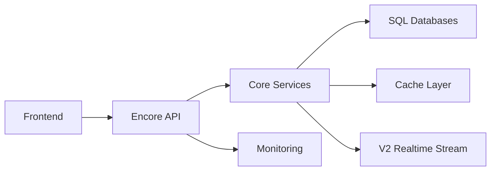

# 🏨 Hospitality Management Platform — Product Documentation (Concise)

Last Updated: 2025-12-09  
Source of Truth (live metadata): 29 services, 608 endpoints via encore-mcp  
Key References:
- API (concise): [docs/API_CONCISE_REFERENCE.md](docs/API_CONCISE_REFERENCE.md)
- API (full): [docs/API_COMPLETE_REFERENCE.md](docs/API_COMPLETE_REFERENCE.md)
- Realtime overview: [README_STREAMING_API.md](README_STREAMING_API.md)
- Finance realtime client notes: [docs/REALTIME_PROVIDER_FINANCE.md](docs/REALTIME_PROVIDER_FINANCE.md)
- Monitoring & networking: [docs/NETWORKING_AND_REALTIME_IMPROVEMENTS.md](docs/NETWORKING_AND_REALTIME_IMPROVEMENTS.md)
- MCP diagnosis: [ENCORE_MCP_SERVER_DIAGNOSIS.md](ENCORE_MCP_SERVER_DIAGNOSIS.md)

---

## 1) Executive Summary

Hospitality Management Platform is an all-in-one solution for multi-property hospitality operations. It centralizes guest onboarding, finance, reporting, staff operations, document handling, and organization management with strong auditability and real-time capabilities.

- Audience: Owners, Property Managers, Finance/Accounts, Operations, Front Desk, Auditors
- Value:
  - Single pane of glass for day-to-day operations
  - Real-time updates across finance, check-ins, and tasks
  - Strong data integrity and audit trails
  - Export-ready reporting (PDF/Excel) for management and compliance
- Architecture: Modular service design with Encore, versioned APIs (/v1), and a multiplexed realtime stream (/v2)

---

## 2) Personas & Roles

- Owner/Admin
  - Full control over organizations, properties, users, and settings
  - Access to all reports and monitoring
- Property Manager
  - Manages a subset of properties, daily finance approval workflows, staff schedules
- Finance/Accountant
  - Creates revenues/expenses, validates daily closing, generates reports and exports
- Operations/Front Desk
  - Manages guest check-ins, verifications, document uploads, and C-Form generation
- Staff/HR
  - Attendance, schedules, leaves, salary components/payslips
- Auditor/Reviewer
  - Read-only access, audit logs, compliance reporting

Role-based access is enforced via JWT with property-level scoping. See [AUTHENTICATION_SYSTEM.md](AUTHENTICATION_SYSTEM.md) and live auth handler summary in encore-mcp.

---

## 3) Core Capabilities (Feature Overview)

Guest Check-in
- End-to-end workflow: create, verify documents, audit trail, checkout
- Document upload, extraction, verification flow
- Automated export generation (PDF/Excel) and C-Form support
- Realtime signals for guest list, audits, and events
References:
- Guides: [docs/GUEST_CHECKIN_GUIDE.md](docs/GUEST_CHECKIN_GUIDE.md), [GUEST_CHECKIN_SUMMARY.md](GUEST_CHECKIN_SUMMARY.md)
- Realtime: [GUEST_CHECKIN_REALTIME_QUICKSTART.md](GUEST_CHECKIN_REALTIME_QUICKSTART.md)
- API: [docs/API_CONCISE_REFERENCE.md](docs/API_CONCISE_REFERENCE.md)

Finance
- Revenues & Expenses with idempotent write support
- Daily approval and closing workflows with enforced rules
- Robust reporting across daily/monthly and P&L
- Reconciliation and migration tooling for data correctness
References:
- Status/Audit: [FINANCE_API_VERSIONING_FINAL_STATUS.md](FINANCE_API_VERSIONING_FINAL_STATUS.md), [FINANCE_API_VERSIONING_AUDIT.md](FINANCE_API_VERSIONING_AUDIT.md)
- Quick recipes: [docs/API_CONCISE_REFERENCE.md](docs/API_CONCISE_REFERENCE.md)

Reports & Exports
- Daily, monthly, P&L; export to PDF/Excel
- Reconciliation and discrepancy detection workflows
References:
- Reporting suite: [REPORTS_API_VERSIONING_FINAL_STATUS.md](REPORTS_API_VERSIONING_FINAL_STATUS.md)
- Export implementation: [DOCUMENT_EXPORT_IMPLEMENTATION.md](DOCUMENT_EXPORT_IMPLEMENTATION.md)

Staff Operations
- Attendance, schedules, leaves, salary components, payslips
- Export support for payroll and attendance analysis
References:
- Staff suite: [STAFF_COMPLETION_GUIDE.md](STAFF_COMPLETION_GUIDE.md), [STAFF_VERSIONING_FINAL_SUMMARY.md](STAFF_VERSIONING_FINAL_SUMMARY.md)

Tasks & Attachments
- Task lifecycle: create, update, assign, status transitions
- Attachment upload and primary image designation
References:
- API map: [docs/API_CONCISE_REFERENCE.md](docs/API_CONCISE_REFERENCE.md)

Properties & Organizations
- Property CRUD, occupancy, theming, and branding
- Organization onboarding and user invitation
References:
- Properties: [PROPERTIES_API_VERSIONING_100_PERCENT_COMPLETE.md](PROPERTIES_API_VERSIONING_100_PERCENT_COMPLETE.md)
- Orgs: [ORGS_API_VERSIONING_100_PERCENT_COMPLETE.md](ORGS_API_VERSIONING_100_PERCENT_COMPLETE.md)
- Branding: [BRANDING_API_VERSIONING_100_PERCENT_COMPLETE.md](BRANDING_API_VERSIONING_100_PERCENT_COMPLETE.md)

Documents & Uploads
- Secure uploads (file info, download, serve), with export engine
- Client-side storage option for performance mitigation (phaseable)
References:
- Client-side storage: [CLIENT_SIDE_STORAGE_IMPLEMENTATION.md](CLIENT_SIDE_STORAGE_IMPLEMENTATION.md)
- Upload limits: [FILE_UPLOAD_SIZE_LIMITS.md](FILE_UPLOAD_SIZE_LIMITS.md)

Monitoring & Operations
- Health, metrics, alerts, partition verification, cache metrics
- Unified monitoring and dashboards
References:
- Monitoring: [MONITORING_API_VERSIONING_100_PERCENT_COMPLETE.md](MONITORING_API_VERSIONING_100_PERCENT_COMPLETE.md)
- Dashboards: [backend/monitoring/MONITORING_DASHBOARDS.md](backend/monitoring/MONITORING_DASHBOARDS.md)

Realtime & Streaming
- Long-poll subscribe endpoints (v1)
- Multiplexed streaming service (v2) with flow control and dynamic subscriptions
References:
- Overview: [README_STREAMING_API.md](README_STREAMING_API.md)
- Finance provider notes: [docs/REALTIME_PROVIDER_FINANCE.md](docs/REALTIME_PROVIDER_FINANCE.md)

---

## 4) System Architecture (High-Level)

- API Layer: Encore services organized by domain (auth, finance, reports, guest-checkin, staff, properties, tasks, users, uploads, monitoring, realtime, etc.)
- Versioning: Legacy paths retained during migration; /v1 is the standard
- Streaming: v2 consolidated stream consolidates service events with credits & filter updates
- Data: SQL databases (hospitality, finance, guest_checkin_db, read_models, event_store) with partitioning options for large tables
- Caching: Multi-tier with invalidation metrics and key patterns

Diagram

Key implementation entry points:
- Realtime: [backend/realtime/connection_pool.ts](backend/realtime/connection_pool.ts)
- Monitoring verify: [backend/monitoring/verify_partitions.ts](backend/monitoring/verify_partitions.ts)
- Finance endpoints: [backend/finance](backend/finance)
- Guest Check-in: [backend/guest-checkin](backend/guest-checkin)

---

## 5) Security, Privacy & Compliance

- Authentication: JWT via a single main auth handler (encore-mcp summary confirms gateway handler “auth” within the auth service)
- Authorization: Role-based (ADMIN, MANAGER), property-scoped access throughout endpoints
- Auditability: Extensive audit logs for guest-checkin and other critical actions
- PII Handling: Documents and guest data must be treated as sensitive; extraction flows support verification and notes
- Transport: HTTPS recommended in all environments; long-poll and streaming secure with bearer token

References:
- Auth docs: [AUTHENTICATION_SYSTEM.md](AUTHENTICATION_SYSTEM.md)
- Audit workflows: [GUEST_CHECKIN_API_VERSIONING_VERIFICATION.md](GUEST_CHECKIN_API_VERSIONING_VERIFICATION.md)

---

## 6) Performance & Reliability

- Caching: ETag-aware GETs; cache metrics and invalidation introspection
- Database: Connection pool stats, replica health, partition readiness and verification
- Streaming: Conflation and compression strategies to optimize event throughput
- SLAs & Targets (typical):
  - Health checks >99.9% availability
  - Standard GET endpoints p95 < 500ms under nominal load
  - Stream delivery latency p95 < 1s

References:
- Networking & realtime: [docs/NETWORKING_AND_REALTIME_IMPROVEMENTS.md](docs/NETWORKING_AND_REALTIME_IMPROVEMENTS.md)
- Monitoring suite: [backend/monitoring/MONITORING_ENDPOINTS_REFERENCE.md](backend/monitoring/MONITORING_ENDPOINTS_REFERENCE.md)

---

## 7) Versioning & Environments

- Standard: /v1 (new), legacy routes maintained during migration window
- Deprecation: Follow headers and plan in [docs/api-versioning-plan.md](docs/api-versioning-plan.md)
- Tooling: Postman/OpenAPI can be generated from live Encore metadata (encore-mcp)

---

## 8) Primary User Journeys (End-to-End)

A) Daily Finance Close
1. Manager records revenues and expenses during the day
2. Approval workflow validates pending items
3. Daily report generated; discrepancies highlighted and reconciled
4. Export PDFs/Excels for managerial review and archival
References:
- Finance suite: [FINANCE_API_VERSIONING_IMPLEMENTATION_SUMMARY.md](FINANCE_API_VERSIONING_IMPLEMENTATION_SUMMARY.md)
- Reports: [REPORTS_API_VERSIONING_FINAL_STATUS.md](REPORTS_API_VERSIONING_FINAL_STATUS.md)

B) Guest Onboarding & Compliance
1. Create check-in with guest details and property mapping
2. Upload documents (extraction-only flow optional), verify data points
3. Generate C-Form and relevant exports for authorities
4. Realtime updates surface changes to dashboards and audit views
References:
- Guide: [docs/GUEST_CHECKIN_GUIDE.md](docs/GUEST_CHECKIN_GUIDE.md)
- Client-side storage: [CLIENT_SIDE_STORAGE_IMPLEMENTATION.md](CLIENT_SIDE_STORAGE_IMPLEMENTATION.md)

C) Staff Payroll Cycle
1. Attendance and schedule data recorded
2. Salary components and payslips generated
3. Aggregate exports for reconciliation and approvals
References:
- Staff guides: [STAFF_COMPLETION_GUIDE.md](STAFF_COMPLETION_GUIDE.md)

D) Operations & Monitoring
1. Health and metrics monitored via unified endpoints and dashboards
2. Cache metrics and partition readiness inform ops decisions
References:
- Monitoring dashboards: [backend/monitoring/MONITORING_DASHBOARDS.md](backend/monitoring/MONITORING_DASHBOARDS.md)

---

## 9) Integrations & Extensibility

- Banking: Placeholder endpoints for future integrations (e.g., Plaid/Yodlee) with reconciliation patterns already defined
- Storage: Encore storage buckets supported; hybrid model documented for attachments and exports
- Pub/Sub: Event-driven flows summarized for realtime distribution

References:
- Event sourcing & pubsub: [ENCORE_PUBSUB_IMPLEMENTATION_SUMMARY.md](ENCORE_PUBSUB_IMPLEMENTATION_SUMMARY.md)
- Enterprise storage strategy: [ENTERPRISE_STORAGE_IMPLEMENTATION_COMPLETE.md](ENTERPRISE_STORAGE_IMPLEMENTATION_COMPLETE.md)

---

## 10) KPI Framework & Reporting

Recommended KPIs
- Occupancy rates by property and period
- Revenue/Expense trends and profit margins
- Check-in throughput and verification completion rates
- Staff attendance reliability and overtime ratios
- System health (uptime, stream delivery latency, cache hit rate)

Data sources
- Reports endpoints for financial metrics
- Monitoring endpoints for system KPIs
- Audit logs for compliance metrics

References:
- API for reports: [docs/API_CONCISE_REFERENCE.md](docs/API_CONCISE_REFERENCE.md)
- Monitoring: [MONITORING_API_VERSIONING_100_PERCENT_COMPLETE.md](MONITORING_API_VERSIONING_100_PERCENT_COMPLETE.md)

---

## 11) Product Roadmap (High-Level)

Near-term
- Expand streaming consumers in frontend dashboards
- Harden reconciliation automation and evidence trails
- Add guided L1 support views for operations

Mid-term
- Bank API integrations and automated matching
- Advanced forecasting and budgeting reports
- Property-level benchmarking and anomaly detection

Long-term
- Marketplace integration (PMS/OTA bi-directional sync)
- Custom analytics workbench for enterprises

---

## 12) Quick Links (Primary Assets)

- Product quick overview: [README.md](README.md)
- API quickstart: [docs/API_CONCISE_REFERENCE.md](docs/API_CONCISE_REFERENCE.md)
- Realtime overview: [README_STREAMING_API.md](README_STREAMING_API.md)
- Guest check-in bundle: [docs/GUEST_CHECKIN_GUIDE.md](docs/GUEST_CHECKIN_GUIDE.md)
- Monitoring bundle: [backend/monitoring/MONITORING_ENDPOINTS_REFERENCE.md](backend/monitoring/MONITORING_ENDPOINTS_REFERENCE.md)
- Finance bundle: [FINANCE_API_VERSIONING_STATUS.md](FINANCE_API_VERSIONING_STATUS.md)
- Staff bundle: [STAFF_VERSIONING_FINAL_SUMMARY.md](STAFF_VERSIONING_FINAL_SUMMARY.md)
- MCP diagnosis: [ENCORE_MCP_SERVER_DIAGNOSIS.md](ENCORE_MCP_SERVER_DIAGNOSIS.md)

---

## Appendix A) Services (Live Inventory)

From encore-mcp (abbreviated):
- Core: auth, properties, finance, reports, guest-checkin, staff, tasks, users, uploads, documents
- Infra & Ops: analytics, cache, communication, config, cron, database, middleware, monitoring, realtime, reports-service, events-service, validation, telemetry, orgs, seed
- Standardized: Legacy + /v1 endpoints; /v2 for streaming
Detailed routes: [docs/API_CONCISE_REFERENCE.md](docs/API_CONCISE_REFERENCE.md)

---

## Appendix B) Compliance & Audit

- Guest audit coverage across access and actions (view, download, verify, export)
- Finance integrity checks and daily approval control gates
- Monitoring coverage for cache, partitions, database health, and replicas

---

End of Product Documentation